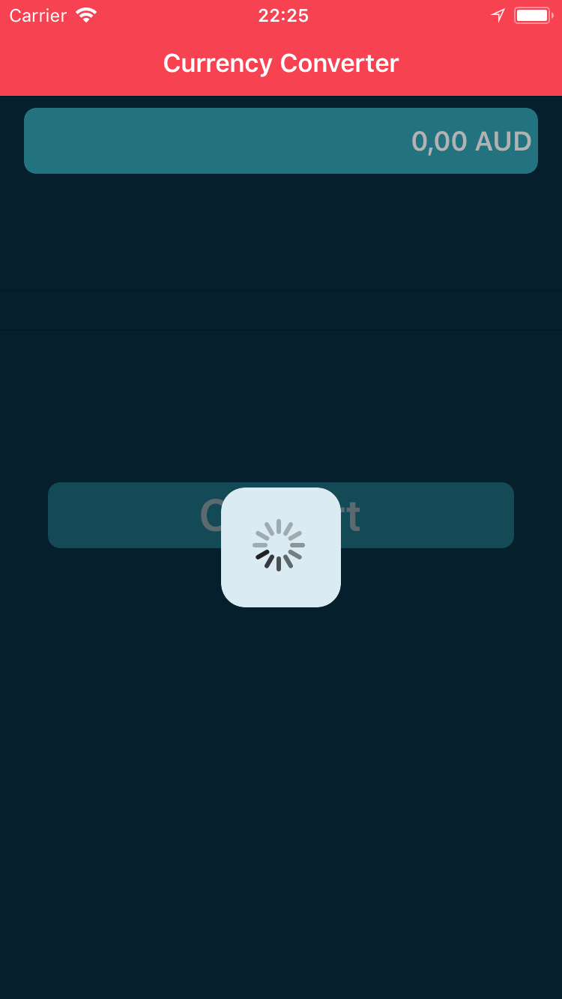
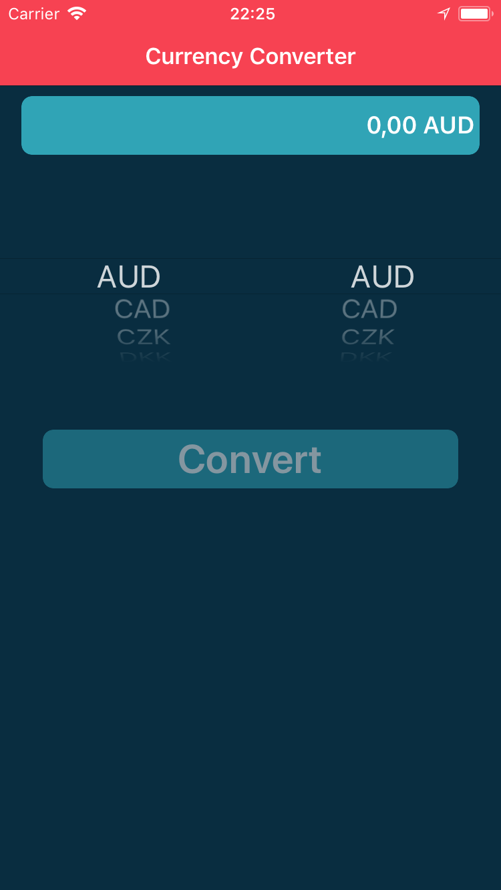
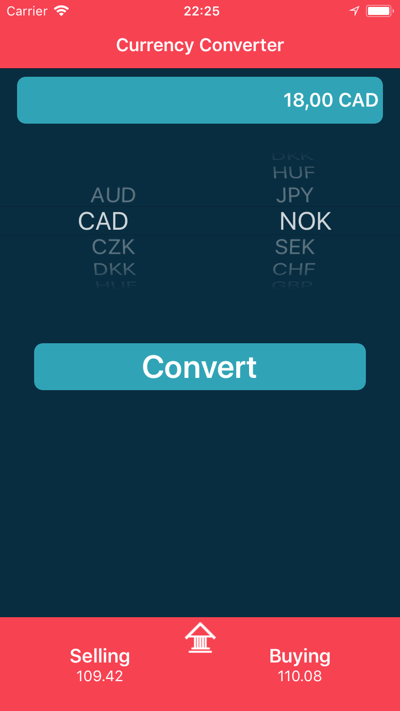
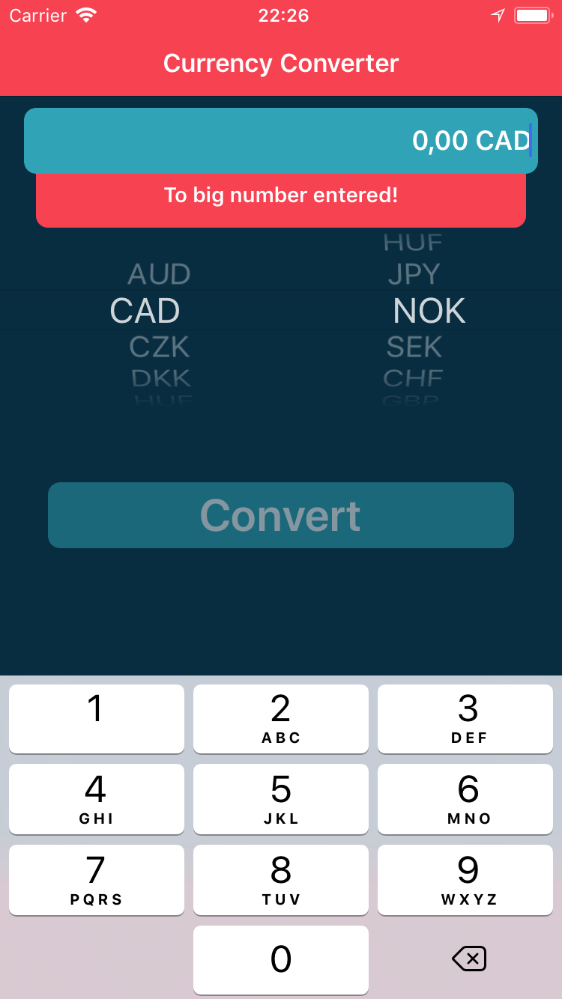

# MyCurrencyConverter

Simple Currency converter calculator based on real time fetching currency selling/buying ratios.

# Workfolw

Apps starts with fetching data and parsing them to corresponding data. If no web connection or fetching session time passed user gets aler with appropriate message. 
If fetching succeeded user is able to select hes value and to which value he wants co convert. When data is entered button for convert will appear. Pressing button users gets hes wanted details for value. In the other hand if user entered too big number he will be alerted for it.

      
